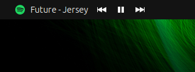

# Spotify Controls 

**Spotify Controls** is a GNOME 45+ Shell extension that integrates Spotify playback controls directly into your GNOME top bar. With this extension, you can effortlessly manage your Spotify music without leaving your workflow. It displays the Spotify logo, current artist, track title, and provides intuitive play/pause, next, and previous buttons.

## Features

- **Real-Time Track Information:** Displays the current artist and track title being played on Spotify.
- **Playback Controls:** Includes play/pause, next, and previous buttons for seamless music management.
- **Dynamic Visibility:** The indicator appears in the top bar only when Spotify is running.
- **Customizable Position:** Choose where the Spotify Controls appear in the top bar (e.g., far-left, center, far-right).
- **Lightweight & Responsive:** Designed to have minimal impact on system performance.

## Screenshots



*The Spotify Controls indicator displaying current track information and playback buttons in the GNOME top bar.*

## Installation

### Via [extensions.gnome.org](https://extensions.gnome.org/)

1. **Install GNOME Shell Integration:**
   - For Firefox: Install the [GNOME Shell Integration extension](https://addons.mozilla.org/firefox/addon/gnome-shell-integration/).
   - For Chrome/Chromium: Install the [GNOME Shell Integration extension](https://chrome.google.com/webstore/detail/gnome-shell-integration/gphhapmejobijbbhgpjhcjognlahblep).

2. **Install Native Connector:**
   - Open your terminal and run:
     ```bash
     sudo apt install chrome-gnome-shell
     ```
     *Note: The package name may vary based on your Linux distribution.*

3. **Visit the Extension Page:**
   - Navigate to the [Spotify Controls Extension](https://extensions.gnome.org/extension/your-extension-id/) on [extensions.gnome.org](https://extensions.gnome.org/).

4. **Toggle the Switch:**
   - Click the toggle switch to install the extension. You may be prompted to confirm the installation.

### Manually from GitHub

1. **Clone the Repository:**
   ```bash
   git clone https://github.com/YourUsername/spotify-controls.git


   
